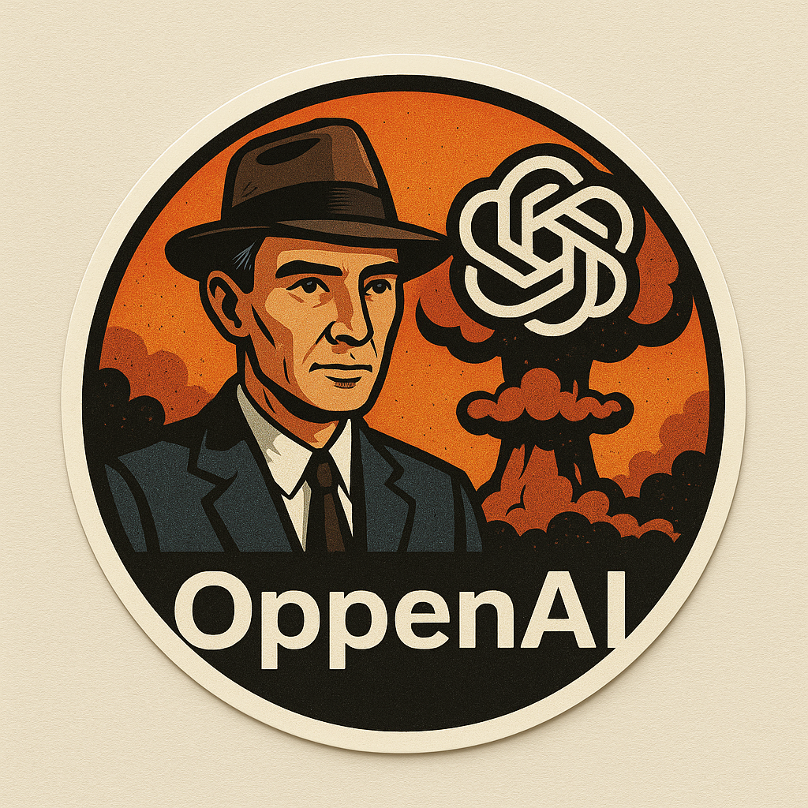

# OppenAI - The LANL Scientific Agent

{width=200px}

Testing a centralized package for an agentic workflow. This should not be the final name, but I am pushing up this code that works. 

requirements.txt is the file that results from pip freeze on the environment I have working at the moment. 
It may have a few extra packages from testing and examples, but it should provide a working environment.

## How to use this code
Better documentation will be incoming, but for now there are examples in the examples folder that should give
a decent idea for how to set up some basic problems. They also should give some idea of how to pass results from
one agent to another. I will look to add things with multi-agent graphs, etc. in the future. 

# Sandboxing
The Execution Agent is allowed to run system commands and write/run code. Being able to execute arbitrary system commands or write
and execute code has the potential to cause problems like:
- Damage LANL code or data on the computer
- Damage the compter
- Transmit LANL data

The Research Agent scrapes data from urls, so has the potential to attempt to pull information from questionable sources.

Some suggestions for sandboxing the agent:
- Creating a specific environment such that limits OppenAI's access to only what you want. Examples:
    - Creating/using a virtual machine that is sandboxed from the rest of your machine
    - Creating a new account on your machine specifically for OppenAI 
- Creating a network blacklist/whitelist to ensure that network commands and webscraping are contained to safe sources

You have a duty for ensuring that you use OppenAI responsibly.

